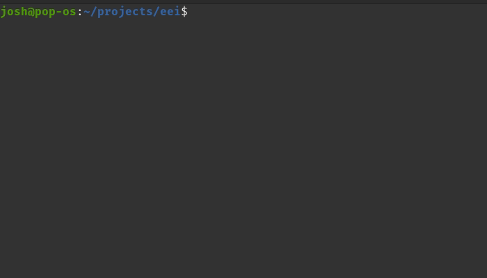

# Extended English Input

Extended English Input (EEI) is an IBus input method that I wrote primarily for my personal use, because I was sick of
having no good way to input emojis and math symbols into most applications. It's a little bit like a
faster and _much_ smaller [IBus typing booster](https://github.com/mike-fabian/ibus-typing-booster)
that does way less.



## Installation

Assuming you are set up to compile both C and Rust, installation should be
as simple as:

```shell
git clone git@github.com:Mindful/eei.git
./install.sh
```

## Advanced installation
Further instruction can be found at [`INSTALL`](INSTALL)

## Usage

Then, to actually use your new input method:

```shell
ibus restart
ibus engine eei
```

`ctrl+e` opens the emoji/symbol lookup table.
`ctrl+w` while in the middle of typing a word opens autocomplete for that word.

## Generating dictionary data
Binary dictionary data is included in the git repository, so this step is not 
necessary unless you want to rebuild or modify the dictionary data. 

First, download the en_US hunspell dictionary data from http://wordlist.aspell.net/dicts/
```shell
sudo apt-get install hunspell-tools
wget http://downloads.sourceforge.net/wordlist/hunspell-en_US-2020.12.07.zip
unzip -o hunspell-en_US-2020.12.07.zip
unmunch en_US.dic en_US.aff > hunspell_US.txt
```

Then get the word frequency data
```shell
wget https://norvig.com/ngrams/count_1w.txt
```

Finally, run the preprocessing script
```shell
cd src/predict
# Can also pass just one of "symbols" or "dictionary" to regenerate only that portion
cargo run --package preproc --bin preproc symbols dictionary
```

This will generate `dictionary.fst`, `shortcodes.fst` and `symbols.bin`.


## IBus resources

Documentation for IBus is pretty poor, so much of the code here is based off of
the below repos:
* [ibus-tmpl](https://github.com/phuang/ibus-tmpl)
* [ibus-unikey](https://github.com/vn-input/ibus-unikey)
* [ibusenginesimple](https://github.com/ibus/ibus/blob/master/src/ibusenginesimple.c)
